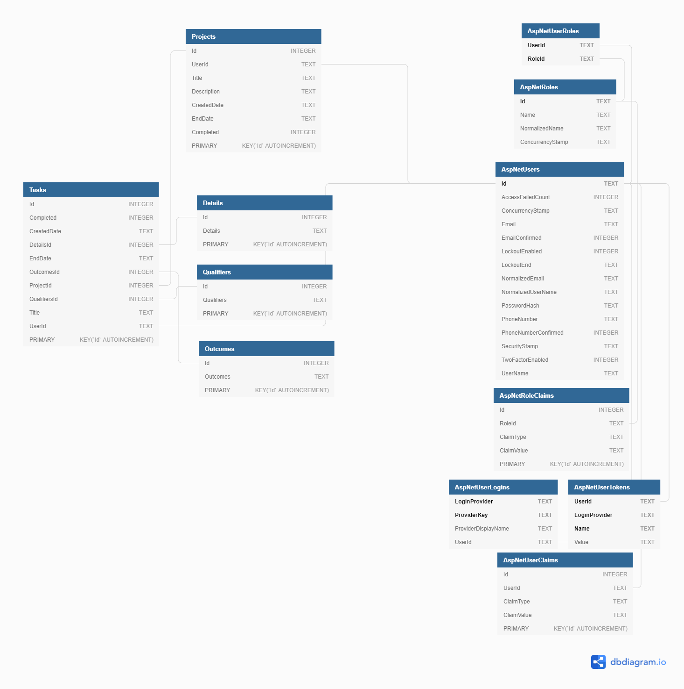

# 2BeDone

[](https://github.com/leolazz/ToDoList/actions/workflows/Integrate.yml)

# Description:

2BeDone is a Web Based project and task tracker.

### Why I made this:

As a first project the goal was to exercise skills learned from various courses and be a cumulative demonstration of knowledge and ability, while learning additional skills, and trying to finish the project quickly.

### Constraints & Challenges:

- Beginner level experience and knowledge
- Learning and adhering to S.O.L.I.D. principles
- Trying to complete the project quickly while solidifying new information.
- Not getting lost in the weeds of the minutiae of less relevant aspects.

### Results:

-


## ERD



## Installation

Target ASP.NETCore 5.0 MVC

Download ToDoList project folder and open in visual studio

## Requirements

**Dotnet SDK v5**

- https://dotnet.microsoft.com/download/dotnet/5.0

**Dotnet Core v3.1**

- https://dotnet.microsoft.com/download

## Usage

```bash
# build the solution
$ dotnet build
# run the solution
$ dotnet run

# build src
$ dotnet build src
# run src
$ dotnet run --project src

# build tests
$ dotnet build tests
# run tests
$ dotnet run --project tests
```

## Docker

```bash
# pull the image
$ docker pull leolazz/2bdone
```

```bash
# build the container image
$ docker build -t <ImageName>:<TagName> .
```

```bash
# docker run the built container image
# OPTIONAL: Add a bind mount to a SQLite .db for persistance
$ docker run -it -p 5001:80 --name <ContainerName> <ImageName>
```

```bash
# push the built container image to docker hub
$ docker push leolazz/2bdone:<TagName>
```

```bash
# run the pulled image
$ docker run leolazz/2bdone:<TagName>
```

## Docker-compose

```bash
# launch with docker-compose
$ docker-compose up
```

## Contributing

Pull requests are welcome. For major changes, please open an issue first to discuss what you would like to change.

## License

[MIT](https://choosealicense.com/licenses/mit/)
